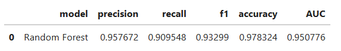
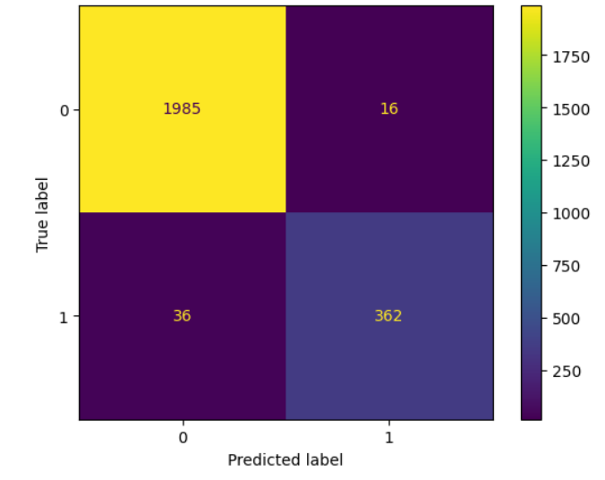
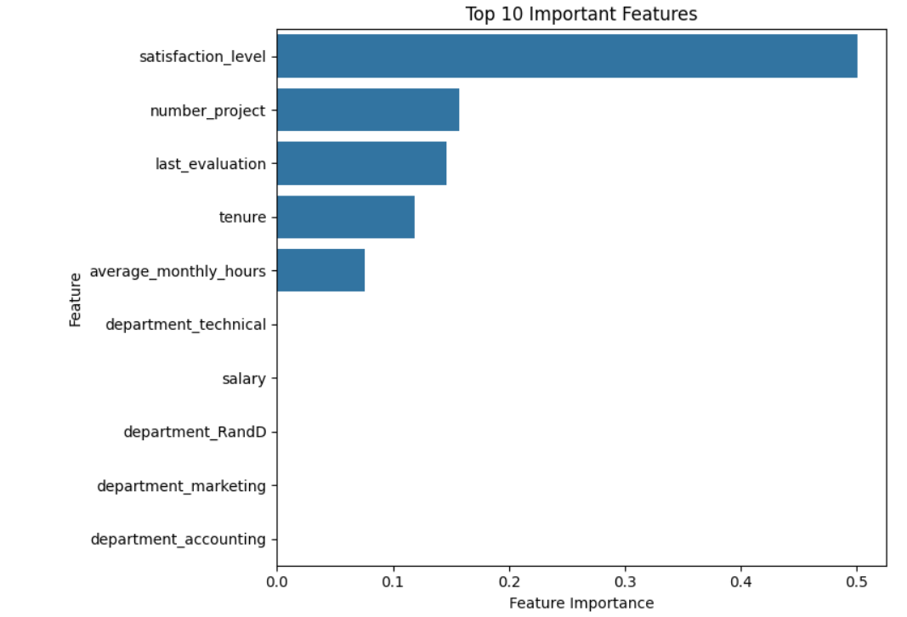
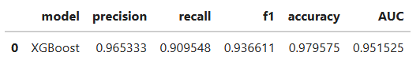
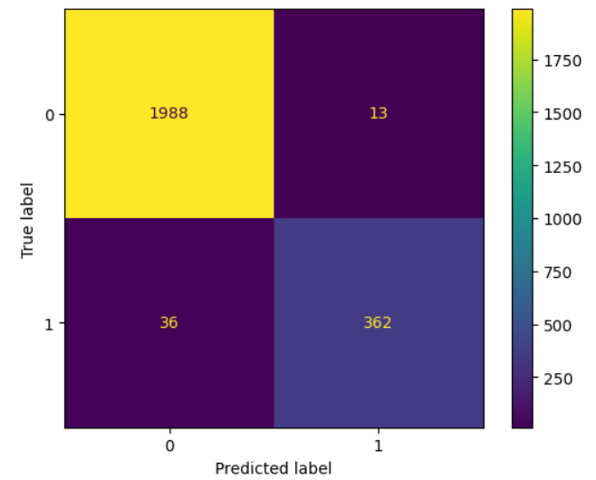
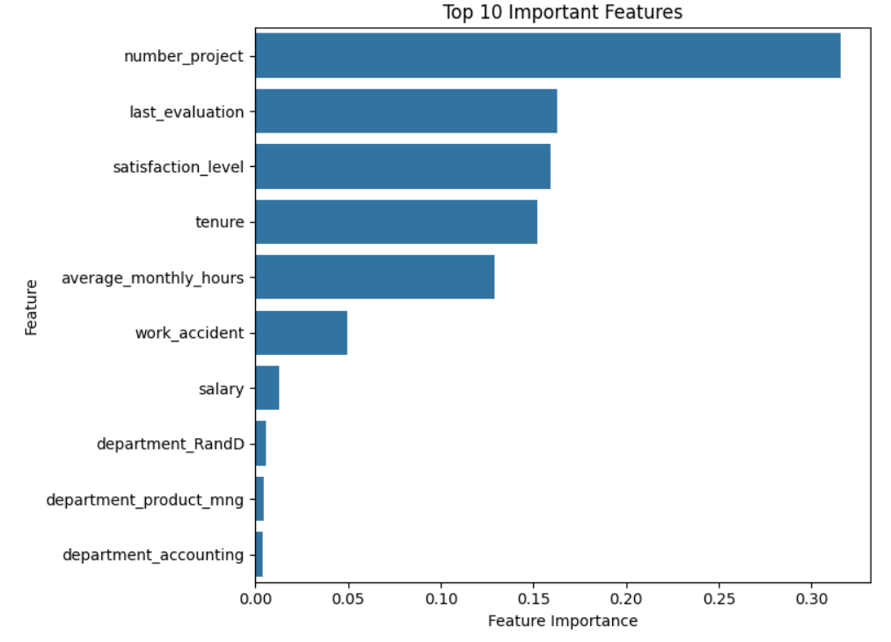

# Predicting Employee Attrition (Google Advanced Analytics Certificate Capstone Project)

## Project Overview

The goal of this project was to develop a machine learning model to predict whether an employee is likely to leave the company. The dataset, based on the fictional company Salifort Motors, includes features such as employee satisfaction level, average monthly hours, number of projects, tenure, and an indicator of whether the employee has left. Two models were built - Random Forest and XGBoost - achieving an AUC scores of 95.0% and 95.1%, precision scores of 95.7% and 96.5%, and recall scores of 90.9% and 90.9%, respectively. Model results showed that satisfaction level, tenure, number of projects and last evaluation score were the strongest predictors of turnover. Although both models performed well, XGBoost provided slightly stronger overall predictive performance.

All the code used for data cleaning, exploratory analysis, model training, and evaluation is included in the accompanying Jupyter Notebook file project_notebook.ipynb. This notebook contains all steps of the project, from loading and preprocessing the dataset to building the Random Forest and XGBoost models, generating performance metrics, and visualizing feature importances. It can be run end-to-end to reproduce the results presented in this report.

## Business Understanding 

The HR department at Salifort Motors wants to understand why some employees leave the company and how to improve retention. High turnover increases recruitment and training costs while lowering productivity. The main stakeholders are the HR team and company leadership, who aim to use data-driven insights to design better retention strategies. This project analyzes HR data to identify key factors influencing turnover and builds a predictive model to flag employees most at risk of leaving.

## Data Understanding

The dataset, originally from Kaggle and provided through Coursera as part of the Google Advanced Data Analytics Certificate, contains 15,000 rows and 10 columns. It includes features such as employee satisfaction level, last performance evaluation score, number of projects, tenure, salary, and more. The data is slightly imbalanced, with 83.3% of employees retained and 16.7% who left the company.

Before building the model, exploratory data analysis (EDA) was performed, which included renaming columns, removing duplicates, checking for missing values and outliers, and creating visualizations to explore relationships between variables.

## Modeling and Evaluation

To predict employee attrition, a binary classification problem, two ensemble learning models were developed. The dataset was split 80–20 into training and testing sets.  
First, a random forest model with 500 decision trees was trained. The table and confusion matrix below show its performance on the test data, along with the most important features contributing to employee attrition.

  

Next, an XGBoost model with 100 decision trees was created. Its results and feature importances are shown in below.

  

Both models achieved an recall score of 90.9%. XGBoost demonstrated slightly higher precision (96.5%), accuracy (97.9%), F1 (93.6%), and AUC scores (95.1%).

As for the most important factor influencing employee turnover, the random forest model identified satisfaction score, while for the XGBoost model it was tenure. Additional key features included number of projects and last evaluation score. In future iterations, feature engineering could enhance model performance, for example, by combining variables such as average monthly hours and number of projects to represent burnout level.

Overall, XGBoost is the stronger choice for this project, as it provides higher precision, accuracy, F1-score, and AUC while maintaining the same recall as the random forest model.

## Conclusion

This project identified the main factors influencing employee turnover at Salifort Motors and built predictive models to help the HR team take proactive action. Both random forest and XGBoost performed well, highlighting satisfaction level, tenure, number of projects, and last evaluation score as the strongest predictors of attrition.

It is recommended that the company focus on improving employee satisfaction and monitoring staff with low satisfaction or heavy workloads. Future steps include feature engineering to better capture burnout and adding more employee engagement data (such as gathering survey data about workplace culture, career growth and management).
